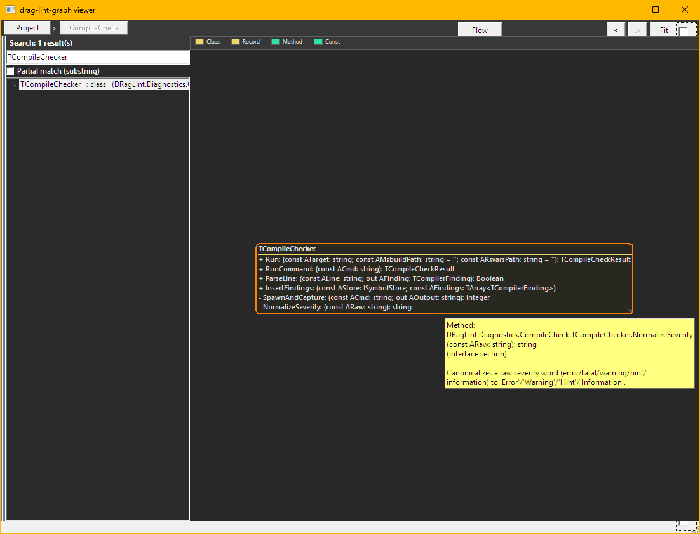
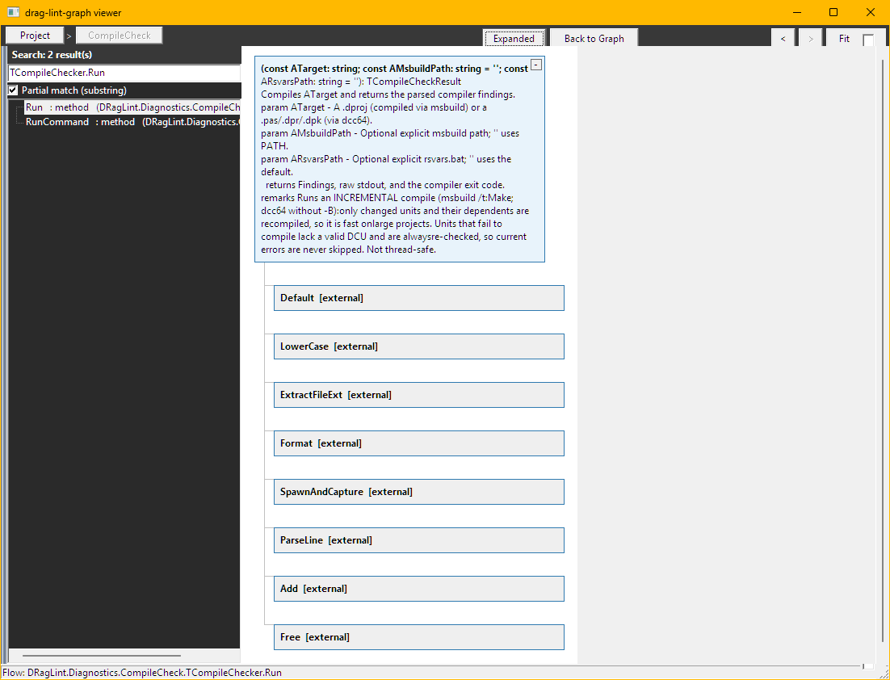
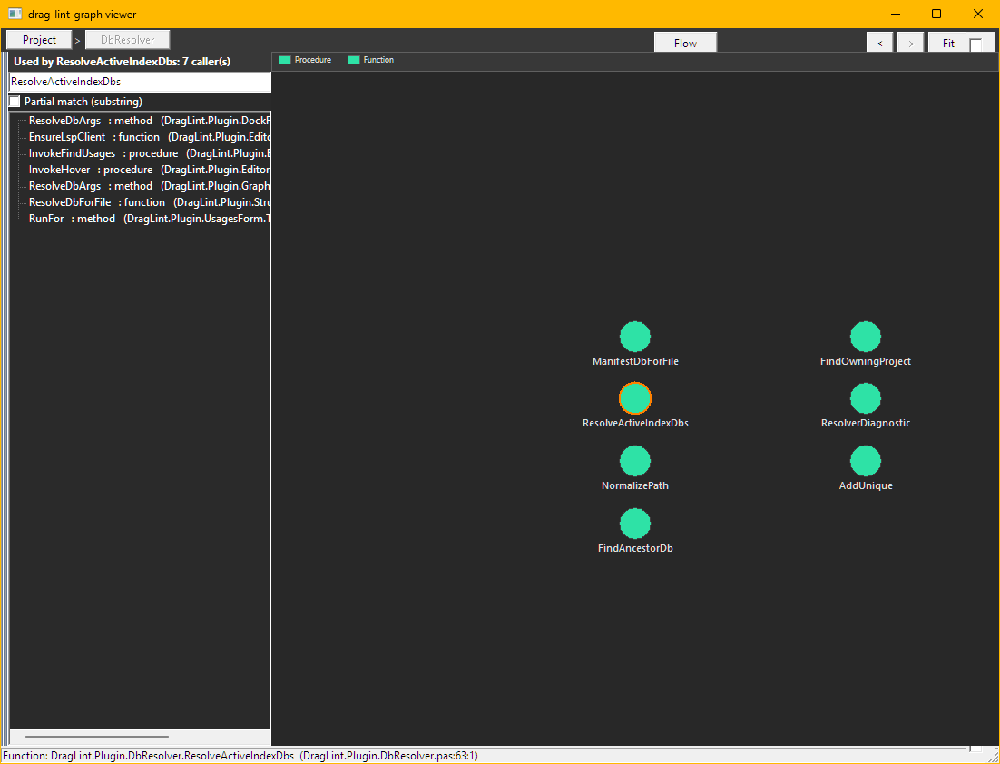

# Delphi-RAG-Lint-Graph

> **⚠️ Early alpha / experimental — work in progress.** This is a young companion
> to [Delphi-RAG-Lint](https://github.com/Alexl-git/Delphi-RAG-Lint), under active
> daily development. Expect rough edges and breaking changes. Shared early so the
> Delphi community can try it and shape it. **Feedback and suggestions are very
> welcome** — please open an
> [Issue](https://github.com/Alexl-git/Delphi-RAG-Lint-Graph/issues).
> Not recommended for unattended/production use.

Pure-VCL interactive graph viewer and reusable component for the
[Delphi-RAG-Lint](https://github.com/Alexl-git/Delphi-RAG-Lint) symbol index.
Reads the drag-lint SQLite DB(s) directly -- no WebView2, no HTML, no JS.

This component supersedes a previously considered WebView2 + Cytoscape.js
approach, which was declined in favour of a native VCL canvas solution.

---

## Screenshots

### UML class view, with doc on hover
Search a type — it drills into its unit and draws the class as a UML box (members
with visibility glyphs and full signatures); hover a member for its DocInsight doc.



### Code Flow View
Trace a routine's calls as a flowchart — each box carries its DocInsight summary
(here `TCompileChecker.Run`).



### Where Used
A precise, clickable list of a symbol's callers, beside its unit's call graph.



---

## What it is

- **`TDragLintGraphControl`** -- a passive VCL `TWinControl` you drop on a form
  to show a force-directed, pannable, zoomable, clickable graph of the symbol
  network that drag-lint indexes: units, types, methods, callers, callees, DFM
  bindings, SQL tables/columns/stored-procs, and more.

- **`drag_lint_graph.exe`** -- a standalone demo/viewer EXE.  Pass one or more
  drag-lint DBs on the command line; the viewer loads and renders each graph.

- **No WebView2.**  No HTML, no JavaScript, no embedded browser.  Pure Delphi
  canvas rendering, native Windows event handling.

---

## Architecture -- near-MVVM

### Model

- `TGraphData` -- node/edge store with 4-level hierarchy:
  Project > Unit > Object (class/record/interface) > Member.
- `IGraphSource` -- abstraction over data sources (fake source for tests,
  `TDbSource` for real DBs).
- `IDbCatalog` -- cross-store name resolver (jumps across multiple DBs).

### ViewModel

`TGraphViewModel` handles all projection logic; the view is passive:
- Collapse/expand nodes (hides descendants, re-routes edges to the collapsed
  ancestor).
- Neighborhood focus / isolate mode (dims or hides non-neighbours).
- Navigation back-stack for cross-DB jumps.
- Edge section annotation (interface-section vs implementation-section uses).
- SQL Tier 1 symbols (sql_table, sql_column, sql_proc, sql_trigger, sql_view,
  sql_index) rendered as first-class nodes with distinct shapes/colours.

### View

`TDragLintGraphControl` + `TGraphStyle` -- pure canvas renderer.  Receives a
projected `TGraphData` from the ViewModel; no business logic lives here.  The
`Style` object controls colours, node shapes, edge colours by section/kind.

#### Interaction

| Gesture | Action |
|---|---|
| Left-click a **container** (Project/Unit/Class/Record) | expand / collapse it (`ExpandOnSingleClick`, default on) |
| Left-click a **leaf** (method/field/property/sql_column) | open its source (`OnOpenSource`) |
| `Ctrl`+left-click any node | open source (power override) |
| `Shift`+left-click | focus that node's 1-hop neighborhood |
| Double-click | navigate into (expand ancestors + select) |
| Drag empty space | pan; mouse-wheel | zoom |
| `F` | focus selected; `Esc` | clear focus, then collapse "Show all" back to high-level |
| `Backspace` | navigate back (cross-DB / drill stack) |

"Open source" is delegated to the host via `OnOpenSource`. The demo viewer
hands the `(file, line)` to the **running** Delphi IDE through the drag-lint
plugin over a named pipe (`DragLint.Graph.OpenSourceClient`), falling back to
the OS file association when no plugin is listening. See
`docs/ipc-open-source-contract.md`.

### Dependency-free core

The units in `src/control` that deal with Types, Source (fake), ViewModel,
Style, and Layout have NO FireDAC dependency and NO VCL dependency.  Only
`DragLint.Graph.Source.Db` links FireDAC; only `DragLint.Graph.Control` links
VCL.  This enables headless unit testing and future BPL split.

---

## Data source

The component reads drag-lint SQLite DBs **directly via FireDAC**, in
read-only + immutable mode (`OpenMode=ReadOnly` + `immutable=1`).  This means:

- No `-wal` / `-shm` sidecar files are created next to the user's DBs.
- The viewer can coexist with a live drag-lint indexer process without
  "database is locked" errors.
- The DB is never written to.

One graph per DB.  Cross-DB references (e.g. a method call into a library or
SQL-tier DB) cause the ViewModel to jump to the target DB, with a back-stack
so the user can navigate back.  Repeat `--db` flags open multiple stores.

---

## Directory layout

```
src/
  control/         TDragLintGraphControl + supporting units
                   (Types, Source, Source.Db, ViewModel, Style, Layout,
                    OpenSourceClient, Control)
  viewer/          drag_lint_graph.dpr -- demo host EXE
tests/
  console/         Headless unit test suite (41 tests, no GUI required)
  autotest/        GUI smoke test -- builds and launches the viewer
build/
  build_viewer.bat Builds drag_lint_graph.exe (Win32 Debug)
docs/
  drag-lint/       drag-lint SQLite schema contract docs
  superpowers/     Implementation specs and plans (AI session artefacts)
```

---

## Build

**Viewer EXE only (now):**

```
build\build_viewer.bat
```

Produces `bin\Win32\drag_lint_graph.exe`.

**All-in-one:**

```
build\build_all.bat
```

Builds runtime BPL + DB BPL + design-time BPL + viewer EXE, then runs both
test gates.

---

## Test

**Headless unit suite (41 tests, no DB required for most):**

```
pwsh tests\console\run.ps1
```

Exit 0 = all green.

**GUI smoke test (builds + launches the viewer):**

```
pwsh tests\autotest\run_smoke.ps1
```

---

## Run

```
drag_lint_graph.exe --db <path-to-drag-lint.sqlite>
```

Repeat `--db` to open multiple stores (e.g. project DB + library DB + SQL DB):

```
drag_lint_graph.exe --db C:\Projects\DB\ORM3\drag-lint.sqlite ^
                    --db C:\Projects\DB\Library\drag-lint.sqlite
```

Running without arguments prints a usage hint.

---

## Status

Phases P1-P5 implemented:

- P1 -- Model (TGraphData, IGraphSource, 4-level hierarchy, edge types)
- P2 -- ViewModel (collapse, focus, nav, cross-DB jump, section annotation)
- P3 -- DB reader (FireDAC, read-only/immutable, SQL Tier 1 nodes)
- P4 -- Style + View (TGraphStyle, TDragLintGraphControl canvas renderer)
- P5 -- Packaging + hardening (immutable open, dead-code cleanup, BPL split)

Live-test findings fixed: **F1-F5** (hover flicker, cross-DB hang, zoom UI,
node labels, off-screen startup) and **F6-F7** (single-click expand /
single-click open-source via named pipe to the running IDE). See
`docs/test-findings-*.md` and `docs/ipc-open-source-contract.md`.

**Deferred (not yet implemented):**

- LOD / semantic auto-zoom (progressive detail as you zoom in)
- In-viewer fuzzy symbol search
- Barnes-Hut / threaded layout for 40 000+ node graphs
- TStyleManager theming support
- SQL Tier 2 / Tier 3 (fb_* Firebird links, ORM relation links)
- Split-screen multi-DB side-by-side view
